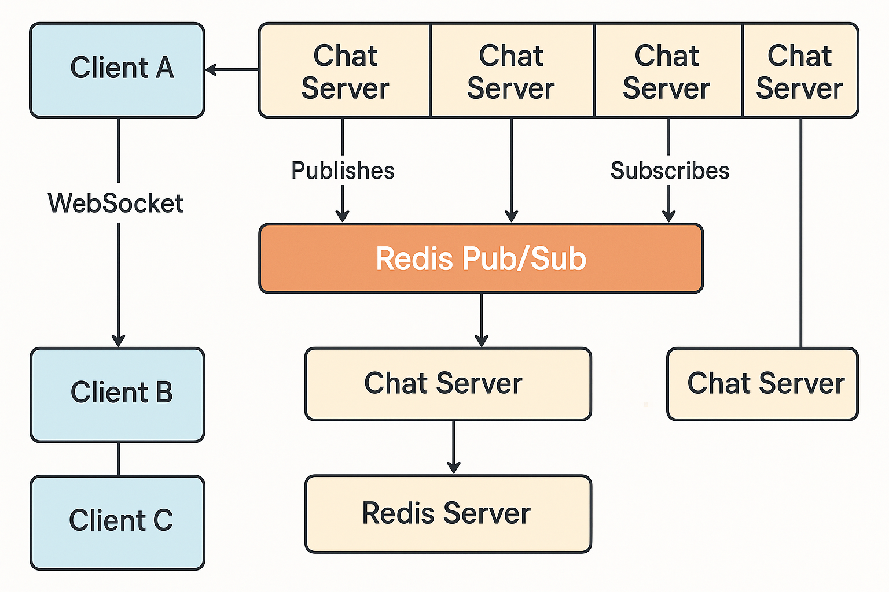

```⚡Distributed Chat App with Redis Pub/Sub (Go + Docker)```



A production-grade distributed chat application written in Go, using WebSockets and Redis Pub/Sub. Built for high concurrency, real-time messaging, and horizontally scalable architecture — containerized using Docker Compose.

🚀 Features

🔌 Real-time bidirectional messaging over WebSockets
📡 Redis Pub/Sub as the message bus
🧵 Lightweight goroutine-based concurrency
📦 Dockerized deployment (multi-container)
💬 Stateless chat servers — built for scalability
🧪 Includes simulation-based test suites under high load, server failure, and Redis downtime
🛠️ Tech Stack

Language: Go (Golang)
Messaging: Redis (Pub/Sub)
Concurrency: Goroutines
Networking: WebSockets
Containerization: Docker & Docker Compose
Testing: Custom test simulators and load scenarios
📂 Project Structure

```
.
├── chat-tests
│   ├── 1_client_to_client/test.go
│   ├── 2_broadcast/test.go
│   ├── 3_websocket_handling/test.go
│   ├── 4_pubsub_reliability/test.go
│   ├── 5_multi_client/test.go
│   ├── 6_server_failure/test.go
│   ├── 7_high_load/test.go
│   └── 8_redis_downtime/test.go
├── cmd
├── docker-compose.yml
├── Dockerfile.server
├── Dockerfile.test
├── go.mod
├── go.sum
├── internal
│   ├── app
│   │   ├── router/ws_router.go
│   │   └── server/ws_server.go
│   └── websocket
│       ├── client.go
│       ├── hub.go
│       ├── message.go
│       └── pubsub.go
├── main.go
├── README.md
├── Test
│   ├── chat_test_suite.go
│   ├── client_simulator.go
│   ├── latencies.csv
│   └── simulation.log
└── test-results
├── broadcast_metrics.csv
├── connections.log
├── failure_metrics.csv
├── message_delivery.log
├── metrics.csv
└── performance.csv
```

▶️ Getting Started

Prerequisites
Docker & Docker Compose installed
Go (for development outside Docker)
Run with Docker Compose
docker compose up --build

Servers will start on port :8080, connect to Redis, and subscribe to the chat-broadcast channel.

Connect via WebSocket
Use wscat or any WebSocket client:

wscat -c ws://localhost:8080/ws?username=alice

📈 Testing and Simulations

This project includes robust tests for real-world scenarios:

✅ Client-to-client delivery

✅ Broadcast integrity

✅ WebSocket lifecycle handling

✅ Redis downtime resilience

✅ High-load simulations

✅ Failure recovery

Run tests using:

go test ./chat-tests/...

💼 For Recruiters

✅ Expert in concurrent system design with Go

✅ Built and managed scalable WebSocket infrastructures

✅ Solid experience with Redis as a pub/sub system

✅ Skilled in Docker-based microservice orchestration

✅ Delivered robust testing strategies for distributed systems


📬 Contact

Email: victorolanikanju@gmail.com
Star the repo if you liked the project — or reach out if you're hiring engineers who thrive in real-time systems & backend infrastructure.
